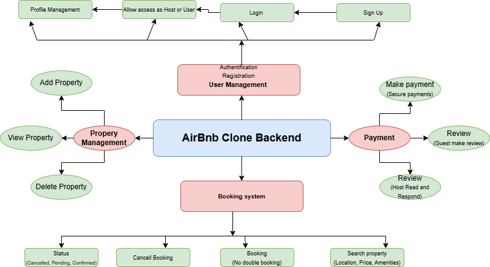

# Airbnb Clone – Backend Features and Functionalities

This document outlines the core backend features and functionalities required for the Airbnb Clone project. It serves as a guide to understanding the essential systems and their interactions, as visualized in the attached diagram.

##  Overview

The backend of the Airbnb Clone project is designed to support the following main systems:

- **User Management**
- **Property Listings**
- **Booking System**
- **Payment Handling**
- **Authentication & Authorization**
- **Review & Rating System**

---

## 📌 Key Features

### 1. User Management
- User registration and login
- Profile management
- Role-based access (host vs. guest)

### 2. Property Management
- Hosts can create, update, or delete property listings
- Each property includes: title, description, location, price, availability, and photos

### 3. Booking System
- Guests can view availability and book properties
- Hosts can approve or reject booking requests
- Booking history is stored for both parties

### 4. Payment System
- Secure payment gateway integration
- Payment tracking and receipts
- Refund management for cancellations

### 5. Authentication & Authorization
- Secure login using tokens/sessions
- Only authenticated users can perform certain actions (e.g., book, list)

### 6. Reviews and Ratings
- Guests can leave reviews and ratings after a stay
- Ratings affect property visibility and trust level

---

##  Diagram

The diagram below (airbnb_features_diagram.png) visually summarizes the key systems and their relationships:

> 

---

##  Purpose

This documentation helps developers and collaborators understand the architecture of the backend before implementation begins.

