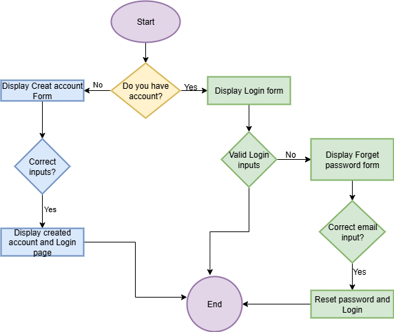

# User Registration Flowchart

This flowchart outlines the backend process for user registration in the Airbnb Clone project.

## Steps Covered:
- User provides registration details (username, email, password)
- System checks for input validation
- System checks if email is already registered
- If valid, user is created and data stored in the database
- Confirmation response sent to the user

