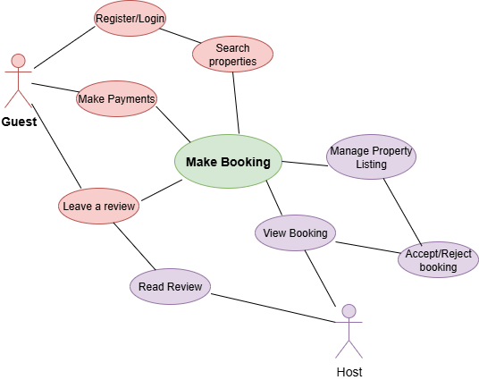

# Use Case Diagram – Airbnb Clone

This folder contains the use case diagram for the Airbnb Clone backend system.

The diagram visualizes how different users (Guests, Hosts) interact with the system for key functionalities such as registration, bookings, and payments.

